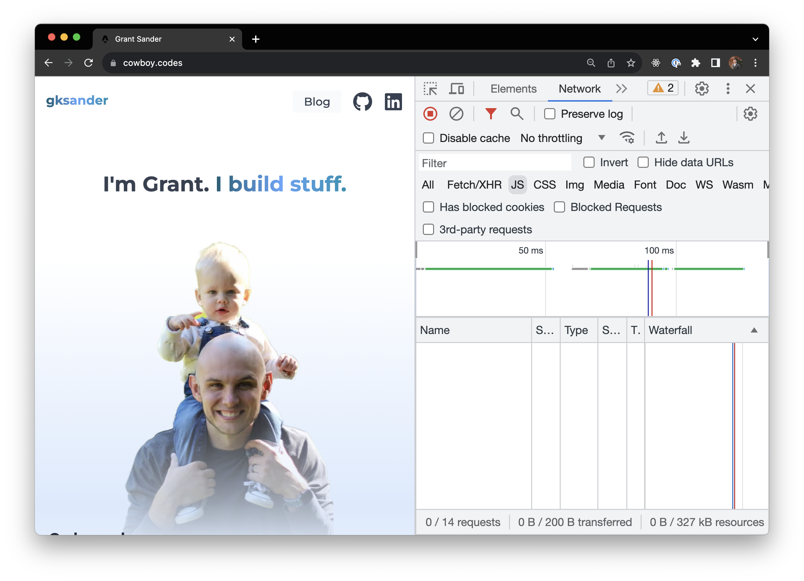

import { Counter } from "./_assets/Counter";

For a number of years, my personal site has been built on [Next.js](https://nextjs.org/). I recently decided I wanted to start writing independently (so that I can randomly lob my thoughts out into the internets), and so I embarked on the journey of adding MDX blogging to my existing Next.js 13 site.

I quickly ran into Next.js yelling at me about adding `"use client"` or something (probably my fault), and decided that the complexities of server and client components – and the _fat_ client-side bundle Next.js ships by default – just wasn't worth it for something fundamentally as simple as my portfolio/blog site.

## Tight like skinny

So, say hello to my little friend: [Astro](https://astro.build/). Astro is a relatively new web framework with a fundamentally different value proposition than the rest of them: you can use your favorite frontend framework as a backend templating language, and ship client-side framework code _only_ when you really need it (e.g. when an interactive component comes into the viewport).

For me, it's basically the perfect framework for building my personal site. I can use Preact or Svelte for templating or when I want to make interactive components, but ship nearly zero client-side JS on pages where nothing crazy is going on. For example, here's my home page:



See that? **No JS!** If you scroll down a bit, some light Preact + component code will load in asynchronously to handle a bit of user interaction, but it's only loaded when it's actually needed. This keeps shit _mean and lean_. The thing is, there are _so many_ sites that don't really require that much client-side JS, but developers (including myself) do prefer to use the modern frontend tooling to build out the sites. Astro strikes a nice balance.

## Tight like fun

Astro, to a degree, was built for making content-driven sites – and excels at making static sites like this one. There are a lot of things that come nearly for free, which makes the developer experience really enjoyable:

- Just run `npx astro add preact` or `npx astro add svelte` etc to add integration with your favorite frontend framework.
- Adding TailwindCSS is as easy as `npx astro add tailwind`.
- It supports [MDX out of the box](https://docs.astro.build/en/guides/markdown-content/) with some niceties like code highlighting, which is lovely for a developer authoring nerd content.
- It handles [image optimization](https://docs.astro.build/en/guides/assets/) for you (to a degree). With a tiny bit of code, you can actually leverage Astro's image optimization pipeline to generate AVIFs and WebPs for you, and serve the right one to the right browser.
- And a lot more.

Most of the building blocks for building a performant, content-driven site are there – you just have to put them together as you see fit. You don't have to slog through a ton of boring stuff, like configuring every bit of your Markdown/remark/rehype toolchain or manually writing code to have `sharp` make next-gen formats of your images.

## Tight like cool

Markdown-driven authoring workflows are pretty popular, but there's a limit to what you can do with Markdown alone. MDX has hit the scene and allowed the addition of frontend components to Markdown – basically indefinitely expanding your horizons (if you try hard enough).

Astro treats MDX as a first-class citizen, and you can add frontend components from most of the top frameworks to your MDX. This is cool, because you could add Svelte examples in a post about Svelte, and React examples in a post about React.

Like, here's an example.

<Counter client:visible />

The code for this component only loads once it's in viewport. All you have to do is write the component, and then have some MDX that looks like this:

```mdx
import { Counter } from "@components/posts/tight-with-astro/Counter";

Oh hey there, check out my cool component:

<Counter client:visible />
```

That's all you need to sprinkle in some interactivity.

### Adding some pizzazz to code blocks

Astro supports [Prism.js](https://prismjs.com/) and [Shiki](https://shiki.matsu.io/) code highlighting in markdown out of the box. It uses a pretty standard unified/remark/rehype configuration so you can customize it to the gills.

This allows a nerd like me to use one of my favorite code highlighting tools: [Shiki Twoslash](https://shikijs.github.io/twoslash/). What the _hell_ is that, you might be wondering. Well, Twoslash is a Shiki extension that allows you to tap into the TypeScript language server to decorate your TS code blocks with _actual_ type information by adding small little comments like `// ^?` or `// @errors: 2339`. Here's an example:

```ts twoslash
// @errors: 2339

// Can show type information
const isSmall = 2 < 3;
//    ^?

// or compiler errors
const bigNumber = (100).addAThousand();
```

This is a neat way to make TypeScript code examples a bit more engaging. In fact, this is the tool that the TypeScript documentation itself uses for it's illustrative examples!

### TailwindCSS for the win

I'm a huge TailwindCSS fan (for many reasons), and using it on a site like this is a real joy. Very easy to support dark mode, can use the `@apply` directive to style up Shiki code blocks (the syntax highlighting is driven by my TailwindCSS theme!), and [the typography plugin](https://tailwindcss.com/docs/typography-plugin) is effectively a drop-in for making prose _like this_ look great by just adding a few classes.

### Dynamic Open Graph images

Vercel has a [whole product](https://vercel.com/docs/concepts/functions/edge-functions/og-image-generation) around dynamically-generated Open Graph images. Which makes sense, because Open Graph images are critically important when sharing content across platforms – but they can be annoying to manually generate at scale.

Using [`node-canvas`](https://github.com/Automattic/node-canvas), some drawing commands, and a dynamic Astro route, I was able to generate Open Graph images for my posts on the fly. Here's an example output:


These images are now generated based on the title and publication date for _all_ blog posts without future effort. Yay for automation!

## Try it yourself

Astro is dead simple to get started with. Just run a:

```sh
yarn create astro
```

and the Astro CLI will walk you through some options and get you rolling. If you want to start with a little more structure, there are quite a few [beautiful, premade themes](https://astro.build/themes) you can try on for size.
